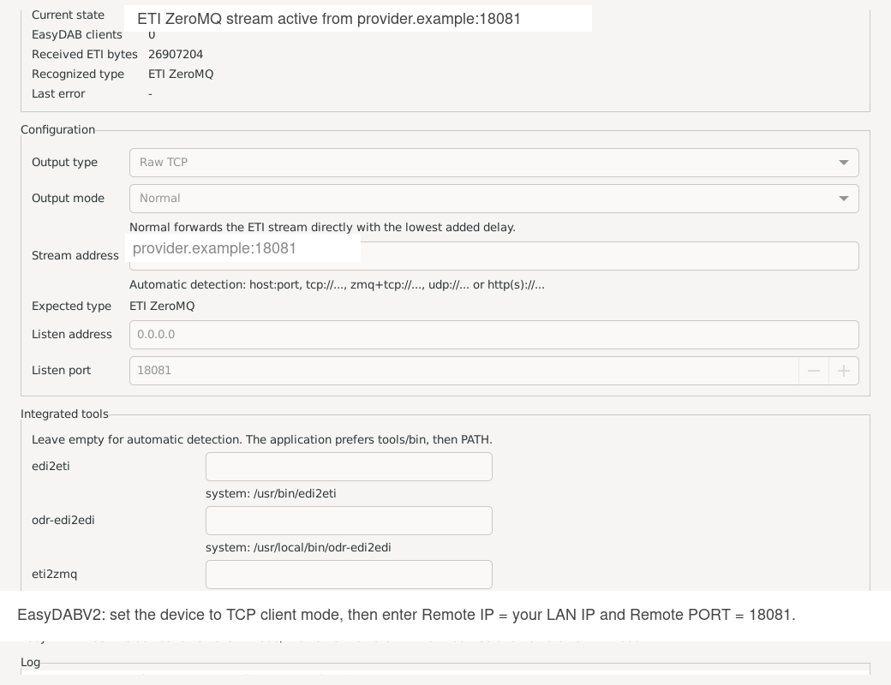

# dabstream2easydab

Small GTK utility to feed an EasyDABV2 from an ETI stream.

The EasyDABV2 documentation describes ETI input over raw TCP or ZeroMQ without
authentication. This project adds a small graphical interface that can:

- relay an ETI stream received from the Internet to a local TCP port;
- convert an EDI UDP or TCP stream to ETI, then relay it to a local TCP or
  ZeroMQ output;
- expose the output as a ZeroMQ endpoint such as `zmq+tcp://*:PORT`, which
  matches common EasyDAB and ODR-DabMux workflows;
- read an ETI source published over ZeroMQ at `zmq+tcp://host:port`;
- keep a local list of saved streams with names, add/edit/remove actions;
- detect and display the current stream type (`EDI UDP`, `EDI TCP`, `ETI`,
  `ETI ZeroMQ`);
- confirm the real stream type automatically after actual input is received;
- provide two output modes:
  - `Normal` for direct forwarding with low latency
  - `Stabilized` for software prebuffering and smoother ETI output;
- show status, connected clients, and a simple activity log.

The EasyDABV2 reference documentation used for this workflow is here:
https://tipok.org.ua/node/46

## Screenshot



The screenshot above shows the main window with the saved streams list, the
status panel, and the full configuration area.

## Installation

### Option 1: Install from a Debian package

This is the recommended option for end users.

The `.deb` package includes:

- the GTK application
- the desktop launcher and menu entry
- the application icon
- bundled copies of `edi2eti`, `eti2zmq`, and `odr-edi2edi`

You do not need to install those three external tools separately when using the
`.deb` package.

Install a package with:

```bash
sudo apt install ./dist/dabstream2easydab_0.1.0-1_amd64.deb
```

Runtime dependencies are handled by the package manager. On Debian/Ubuntu, the
package declares the required libraries and Python runtime components,
including:

- `python3`
- `python3-gi`
- `gir1.2-gtk-3.0`
- `python3-zmq`
- standard runtime libraries such as `libc6`, `libstdc++6`, and `libzmq5`

### Option 2: Install from source

This is the recommended option for development or local modifications.

Use the automated installer:

```bash
./scripts/install-app.sh
```

It is better to run this script without `sudo`.
It will only elevate the `apt` part when needed, while keeping the application
installation inside the user profile.

The script:

- installs the required system dependencies through `apt`
- builds `edi2eti`, `eti2zmq`, and `odr-edi2edi`
- installs the application into `~/.local/share/dabstream2easydab`
- creates a launcher at `~/.local/bin/dabstream2easydab`
- creates a local desktop entry

System packages used by the source installer:

- `ca-certificates`
- `python3`
- `python3-venv`
- `python3-pip`
- `python3-gi`
- `gir1.2-gtk-3.0`
- `python3-zmq`
- `git`
- `build-essential`
- `cmake`
- `autoconf`
- `automake`
- `libtool`
- `pkg-config`
- `libzmq3-dev`
- `libfec-dev`

Useful options:

```bash
./scripts/install-app.sh --dry-run
./scripts/install-app.sh --skip-apt
./scripts/install-app.sh --force-rebuild
```

For a manual developer setup from the repository, the minimum runtime packages
are:

```bash
sudo apt install python3 python3-gi gir1.2-gtk-3.0 python3-zmq
```

In that manual case, you still need working `edi2eti`, `eti2zmq`, and
`odr-edi2edi` binaries from one of the supported lookup locations described
below.

## Building a Debian Package

You can build an installable `.deb` package with the desktop launcher, the menu
entry, the icon, and the bundled toolchain:

```bash
./scripts/build-deb.sh
```

The generated package is written to `dist/`. Install it with:

```bash
sudo apt install ./dist/dabstream2easydab_0.1.0-1_amd64.deb
```

Architecture notes:

- one `.deb` file is produced per architecture
- supported native targets are `i386` (32-bit x86), `amd64` (x64), and `arm64`
- native build from the matching architecture is supported directly
- cross-package assembly from another architecture is also possible with
  `--skip-tools --tool-dir ...` if you already have prebuilt target binaries
  for `edi2eti`, `eti2zmq`, and `odr-edi2edi`

Useful options:

```bash
./scripts/build-deb.sh --arch amd64
./scripts/build-deb.sh --arch arm64 --skip-tools --tool-dir /path/to/arm64-tools
./scripts/build-deb.sh --output-dir release
./scripts/build-deb.sh --skip-tools
./scripts/build-deb.sh --force-rebuild
```

`--skip-tools` reuses compatible `edi2eti`, `eti2zmq`, and `odr-edi2edi`
binaries already available from `.deb-build/`, `tools/bin/`, or the system
`PATH`.

If you want to build the `.deb` with bundled tools on the local machine, install
the Debian build dependencies first:

```bash
sudo apt install build-essential git autoconf automake libtool pkg-config dpkg-dev libzmq3-dev libfec-dev
```

The application can also use locally integrated tools:

- `edi2eti`
- `odr-edi2edi`
- `eti2zmq`

Lookup order:

1. explicit path set in the interface
2. environment variables `DABSTREAM_EDI2ETI`, `DABSTREAM_ODR_EDI2EDI`,
   `DABSTREAM_ETI2ZMQ`
3. binaries copied to `tools/bin/`
4. system `PATH`

To populate the local bundle from tools already installed on the machine:

```bash
./scripts/integrate-mmbtools.sh
```

## Running

From the repository:

```bash
PYTHONPATH=src python3 -m dabstream2easydab
```

Or after an editable installation:

```bash
python3 -m pip install -e .
dabstream2easydab
```

## Example Uses

- Relay an `EDI TCP` source such as `edi-source.example.net:8101` to an
  EasyDAB receiver over `ZeroMQ`
- Receive an `EDI UDP` multicast source such as `239.255.0.1:9000`, convert it
  to `ETI`, and expose it locally over `Raw TCP`
- Subscribe to an upstream `ETI ZeroMQ` source such as
  `zmq+tcp://provider.example:18081` and forward it to another receiver
- Receive an `ETI HTTP` source and republish it locally in `Stabilized` mode
  for sensitive EasyDAB clones

## Using It With EasyDABV2

1. Start the application.
2. Enter a stream address or select one from `Saved streams`.
3. Use `+` to add the current stream to the local library with a name.
4. The application always uses automatic source detection.
5. Check the `Expected type` shown by the interface.
6. Choose the output type:
   - `Raw TCP` for a simple local TCP listener
   - `ZeroMQ` if you already use an endpoint such as `zmq+tcp://*:18081`
7. Choose the output mode:
   - `Normal` for minimum latency
   - `Stabilized` for sensitive EasyDAB receivers or clones with unstable buffers
8. Choose the local listen address and port.
9. Optionally override the tool paths if you want to force specific binaries.
10. Click `Connect`.
11. In the EasyDABV2 web interface:
   - for `Raw TCP`, set `Connection mode` to `TCP client`
   - for `ZeroMQ`, keep your usual ZeroMQ mode if that is already your setup
   - in both cases, enter the PC LAN IP address and the port selected in the
     application

## Notes

- For `EDI/UDP`, the application uses `edi2eti`.
- For `EDI/TCP`, the application chains `odr-edi2edi` and `edi2eti`.
- For `ETI -> ZeroMQ`, the application uses `eti2zmq`.
- For `ETI ZeroMQ` input, the application opens a `SUB` subscription with
  `pyzmq`.
- The interface always uses `Auto` source mode.
- In `Stabilized` mode, the application adds a software prebuffer and smooths
  the ETI output before forwarding it to the receiver.
- To reduce loss on the local `EDI/TCP -> UDP -> ZeroMQ` bridge, the
  application uses `odr-edi2edi -P` and `edi2eti -L`.
- The interface displays the resolution status of each external tool and allows
  path overrides.
- `Recognized type` automatically switches to the real value after actual input
  is received.
- Saved streams are stored in `~/.config/dabstream2easydab/config.json`.
- If the source stops or becomes silent for too long, the application forces an
  automatic reconnect.

## License

This project is licensed under the GNU General Public License,
version 3 or any later version (`GPL-3.0-or-later`). See [LICENSE](LICENSE).

External tools launched by the application keep their own licenses. In
particular, `odr-edi2edi` is GPL and `eti-tools` (`edi2eti`, `eti2zmq`) uses
its own license terms. If you redistribute those binaries together with this
application, make sure to include and comply with their respective licenses as
well. See [THIRD_PARTY_NOTICES.md](THIRD_PARTY_NOTICES.md).
